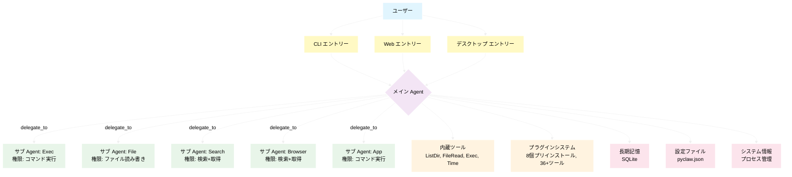

<div align="center">

# 🦞 PyClaw

**プライベート AI アシスタント · デスクトップ + Web + CLI**  
*OpenClaw 上でも動作する Agent フレームワーク*

[](https://www.python.org/)
[](https://www.gnu.org/licenses/gpl-3.0)
[]()

---


</div>

---

## これは何？

PyClaw は**クロスプラットフォーム AI アシスタントフレームワーク**です。

- 🪟 **デスクトップアプリ** — ネイティブウィンドウ（pywebview + WebView2）
- 🌐 **Web アプリ** — ブラウザですぐ使える
- 💻 **CLI ツール** — `pyclaw chat "こんにちは"` で一問一答
- 🤖 **OpenClaw の Agent として** — 設定を共有してシームレスに連携

**こんな人におすすめ：**
- Python 開発者で自分で AI アシスタントを作りたい方
- データをローカルに留めたい方
- 動画編集者（LK-Cut 編集ツール内蔵）
- PPT を素早く作りたい方
- OpenClaw ユーザーで Agent を拡張したい方

---

## クイックスタート

1 行でインストールから起動まで：

```bash
curl -fsSL https://raw.githubusercontent.com/LK-BLOG/PyClaw/main/install.sh | bash
```

```powershell
# Windows PowerShell
iwr -useb https://raw.githubusercontent.com/LK-BLOG/PyClaw/main/install.ps1 | iex
```

> ⚠️ `curl | bash` は便利ですが、実行前にスクリプトの中身を確認することを推奨します。

### 手動インストール

```bash
git clone https://github.com/LK-BLOG/PyClaw.git
cd PyClaw/
pip install -e .
pyclaw setup
```
---

## 💾 ポータブルモード — USBスティックから実行

**インストール不要。痕跡なし。差し込むだけで起動。**

`PyClaw/` フォルダ全体をUSBドライブにコピーし、任意のLinuxまたはmacOSマシンに差し込み、ターミナルから `./start.sh` を実行してください。PyClawはUSBドライブから完全に実行され、システムには書き込まれず、ホストマシンに設定ファイルを残さず、USBを抜くと消えます。

**こんな場合に最適:**
- 公共のコンピュータや借りたコンピュータでAIアシスタントを使いたい場合
- 設定や履歴を常に持ち運びたい場合
- 他人のシステムを汚さずに迅速なデモを行いたい場合
---

### コマンド一覧

| コマンド | 説明 |
|----------|------|
| `pyclaw setup` | 設定ウィザード（API Key / モデル / ポート） |
| `pyclaw start` | 起動（デスクトップ/Web/バックグラウンドを選択） |
| `pyclaw chat "こんにちは"` | 一問一答 |
| `pyclaw shell` | インタラクティブ対話 |
| `pyclaw stop` | 停止 |
| `pyclaw status` | 状態確認 |
| `pyclaw config` | 設定の表示/変更 |
| `pyclaw version` | バージョン情報 |

---

## 内蔵ツール

| ツール | 用途 |
|--------|------|
| `ListDir` | ディレクトリ表示 |
| `FileRead` | ファイル読み込み |
| `Exec` | システムコマンド実行 |
| `Time` | 現在時刻 |
| `delegate_to` | サブ Agent へ委譲 |

## プラグイン（8 個プリインストール、36+ ツール）

| プラグイン | ツール数 | 用途 |
|-----------|---------|------|
| LK-Cut ✂️ | 13 | 動画編集（カット/結合/BGM/エンドロール） |
| PPT 📊 | 10 種 | 純 Python で PPTX 生成 |
| Weather 🌤️ | — | 天気予報 |
| Bilibili 📺 | 4 | B 站投稿 |
| System Info 🖥️ | — | システム情報・プロセス管理 |
| Memory 🧠 | — | 長期記憶管理 |
| Desktop Path 📂 | — | Linux 中文デスクトップパス補助 |
| Skill Manager 🔧 | — | プラグイン管理 |

---

## マルチ Agent アーキテクチャ


---

## 設定

| プロバイダ | デフォルトモデル | Base URL |
|-----------|---------------|----------|
| **DeepSeek** | `deepseek-v4-flash` | `https://api.deepseek.com/v1` |
| **Volcengine** | `ark-code-latest` | `https://ark.cn-beijing.volces.com/api/coding/v3` |
| **カスタム** | 手動入力 | 任意互換 API |

---

## システム要件

- **Python**: 3.9–3.12
- **サイズ**: ~10MB
- **メモリ**: ~50MB
- **起動**: ~5 秒

---

## ライセンス

GNU General Public License v3.0 © 2026 Campus & His OpenClaw

---

<p align="center">
  <sub>🦞 Made by Campus & His OpenClaw</sub>
</p>
